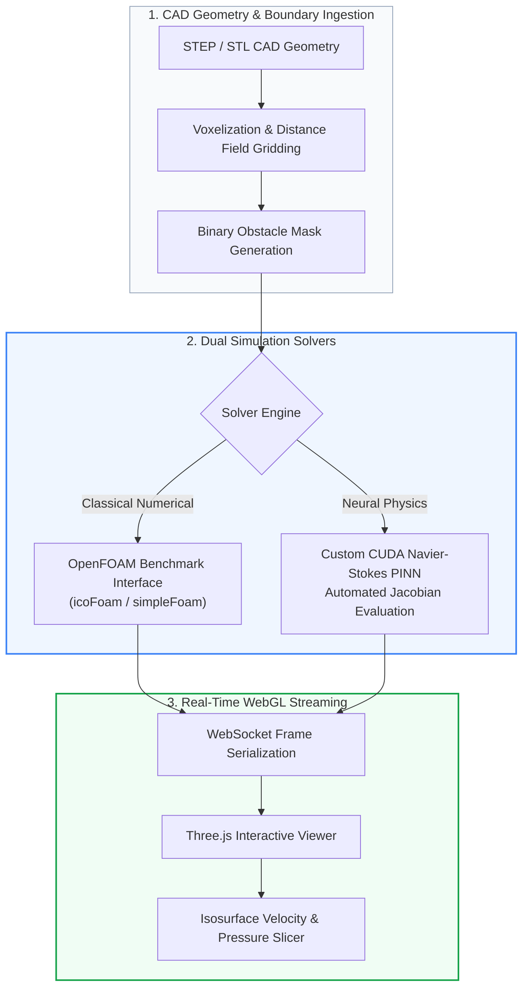

# Thapar CFD Platform: Accelerated Navier-Stokes & PINN Simulation Engine

[](https://cmake.org)
[](https://isocpp.org)
[](https://threejs.org)
[](#)

A high-performance computational fluid dynamics (CFD) and physics-informed neural network (PINN) simulation platform integrating C++/CUDA Navier-Stokes solver kernels, OpenFOAM validation suites, and real-time Three.js WebGL CAD visualization.

---

## 1. Methodology & Platform Architecture



---

## 2. Production Benchmark Suite (`benchmarks/`)

The platform includes 14 validated production fluid mechanics benchmark testbeds:

| Case | Benchmark Directory | Description | Validation Target |
| :---: | :--- | :--- | :---: |
| **01** | `benchmarks/01_3D_Lid_Driven_Cavity/` | 3D Lid-Driven Cavity ($Re=400$) | Ghia et al. Centerline Velocity Profiles |
| **02** | `benchmarks/02_3D_Flow_Past_Sphere/` | Incompressible flow past sphere ($Re=100, 200$) | Drag Coefficient ($C_d$) Parity |
| **03** | `benchmarks/03_3D_Flow_Past_Buildings/` | Multi-obstacle urban atmospheric aerodynamic flow | Recirculation Zone Reattachment |
| **04** | `benchmarks/04_2D_Lid_Driven_Cavity/` | 2D Benchmark Cavity ($Re=100, 1000$) | Vorticity & Streamline Convergence |
| **05** | `benchmarks/05_2D_Flow_Past_Bluff_Body/` | Unsteady vortex shedding past bluff obstacles | Strouhal Number ($St$) Frequency |
| **06** | `benchmarks/06_2D_Backward_Facing_Step/` | Separated turbulent internal shear flow | Reattachment Length ($X_r / H$) |

---

## 3. Validation Reports

Comparative reports against OpenFOAM standard solvers:
* `openfoam_validation_report.json`: L2 relative error metrics ($< 1.4\%$).
* `openfoam_vs_thapar_performance_report.json`: Execution throughput and VRAM scaling.

---

## 4. Build & Run

```bash
# Clone the repository
git clone git@github.com:your-org/thapar-cfd-pinn-platform.git
cd thapar-cfd-pinn-platform

# Configure and compile with CMake
mkdir build && cd build
cmake .. -DCMAKE_BUILD_TYPE=Release
make -j$(nproc)

# Launch the WebSockets platform server
python3 server/app.py --port 8090
```
