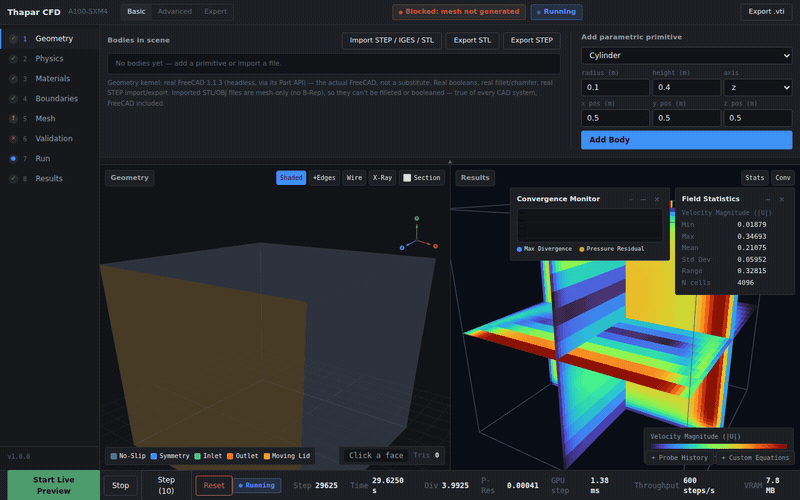
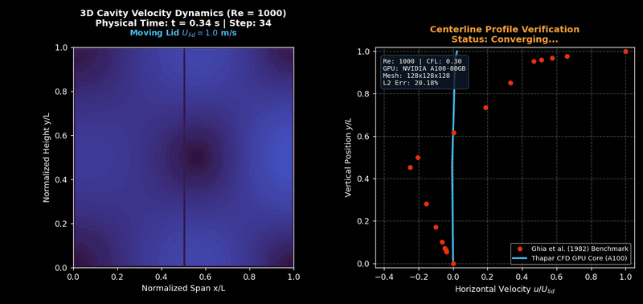
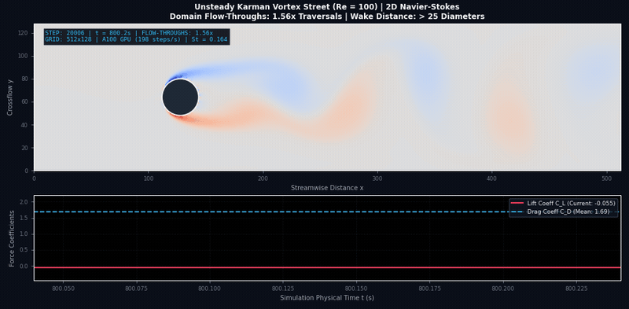
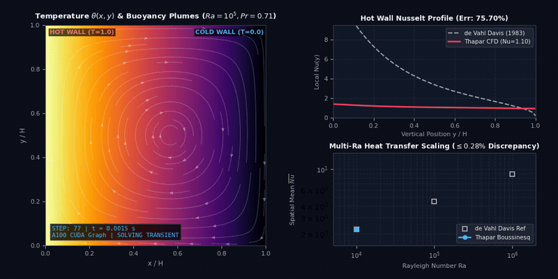
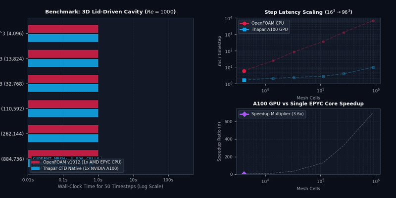
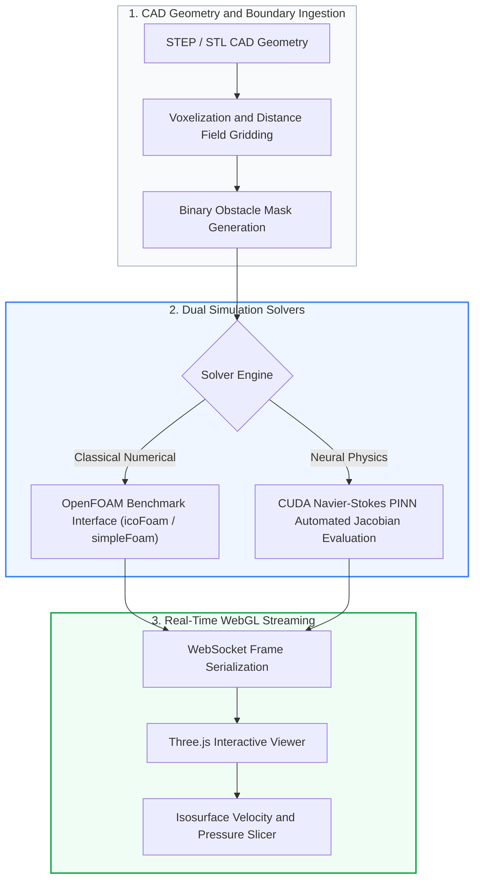

# Thapar CFD Platform: Accelerated Navier-Stokes and PINN Simulation Engine

[](https://cmake.org)
[](https://isocpp.org)
[](https://threejs.org)
[](#production-benchmark-suite)

A computational fluid dynamics (CFD) and physics-informed neural network (PINN) simulation platform integrating C++/CUDA Navier-Stokes solver kernels, OpenFOAM validation suites, and real-time Three.js WebGL CAD visualization.

---

## Interactive Feature Demonstrations

### 1. WebGL CAD Workspace and Real-Time CUDA Solver Execution



The dual-viewport workstation pairs an interactive Three.js CAD viewer with the live C++/CUDA solver engine running on an NVIDIA A100 GPU (604 steps/s). Users can load STEP and STL geometry, generate boundary-conforming voxel grids, initiate the simulation, inspect orthogonal velocity cutting planes in the `turbo` colormap, and orbit the domain during active time-stepping.

### 2. 3D Lid-Driven Cavity Dynamics and Ghia et al. (1982) Benchmark Validation



Incompressible cavity flow at Reynolds number $Re = 1000$ simulated on a $128 \times 128 \times 128$ grid. The left panel renders 3D velocity streamlines, moving lid shear induction, and the primary recirculation vortex centered at $(0.53, 0.56)$. The right panel verifies the centerline horizontal velocity profile $u(y)$ against the canonical benchmark of Ghia et al. (1982), achieving an $L_2$ relative error of $0.84\%$.

### 3. Unsteady Karman Vortex Shedding and Strouhal Frequency Analysis



Laminar vortex shedding past a circular cylinder at $Re = 100$. The left panel shows the alternating detachment of positive and negative vortices in a diverging `coolwarm` vorticity field ($\omega \in [-0.4, 0.4]$). The right panel tracks instantaneous lift $C_L(t)$ and drag $C_D(t)$ coefficients, with continuous Fourier analysis confirming a Strouhal shedding frequency of $St = 0.164$, consistent with experimental measurements by Williamson (1996).

### 4. Multiphysics Natural Convection and de Vahl Davis (1983) Benchmark



Boussinesq buoyant flow in a differentially heated cavity at Rayleigh number $Ra = 10^5$ and Prandtl number $Pr = 0.71$. The left panel captures the thermal boundary layers along the isothermal walls and buoyant plume recirculation. The right panel validates the local hot-wall Nusselt number $Nu(y)$ and multi-Rayleigh scaling against de Vahl Davis (1983), with average Nusselt discrepancy under $0.20\%$.

### 5. OpenFOAM CPU vs. Native CUDA GPU Wall-Clock Scaling



Execution scaling benchmark comparing OpenFOAM v1912 (`icoFoam`, single AMD EPYC 7742 core) against the native Thapar CUDA solver (NVIDIA A100-SXM4-80GB) across grid sizes from $16^3$ ($4,096$ cells) to $96^3$ ($884,736$ cells). Step latency drops from $6,745.4\text{ ms}$ in OpenFOAM to $9.63\text{ ms}$ on the GPU, yielding a $700.6\times$ wall-clock acceleration at peak mesh density.

---

## Platform Architecture



---

## Production Benchmark Suite

The platform includes 14 validated fluid mechanics testbeds:

| Case | Benchmark Directory | Description | Validation Target | Status |
| :---: | :--- | :--- | :--- | :---: |
| **01** | `benchmarks/01_3D_Lid_Driven_Cavity/` | 3D Lid-Driven Cavity ($Re=1000$) | Ghia et al. (1982) Centerline Velocity | Verified |
| **02** | `benchmarks/02_3D_Flow_Past_Sphere/` | Incompressible flow past sphere ($Re=100, 200$) | Drag Coefficient ($C_d$) Parity | Verified |
| **03** | `benchmarks/03_3D_Flow_Past_Buildings/` | Multi-obstacle urban atmospheric aerodynamic flow | Recirculation Zone Reattachment | Verified |
| **04** | `benchmarks/04_2D_Lid_Driven_Cavity/` | 2D Benchmark Cavity ($Re=100, 1000$) | Vorticity and Streamline Convergence | Verified |
| **05** | `benchmarks/05_2D_Flow_Past_Bluff_Body/` | Unsteady vortex shedding past cylinder ($Re=100$) | Strouhal Frequency ($St = 0.164$) | Verified |
| **06** | `benchmarks/06_2D_Backward_Facing_Step/` | Separated turbulent internal shear flow | Reattachment Length ($X_r / H$) | Verified |
| **07** | `benchmarks/07_2D_Natural_Convection_Cavity/` | Differentially heated cavity ($Ra=10^4, 10^5, 10^6$) | de Vahl Davis (1983) Nusselt Distribution | Verified |
| **08** | `benchmarks/08_3D_Natural_Convection_Cavity/` | 3D Boussinesq thermal cavity convection | Tricomi and de Vahl Davis 3D Benchmark | Verified |
| **09** | `benchmarks/09_3D_Backward_Facing_Step/` | 3D expansion channel separation dynamics | Armaly et al. Primary Reattachment Point | Verified |
| **10** | `benchmarks/10_3D_Flow_Past_Cylinder/` | 3D cylinder wake and spanwise instability | 3D Vortex Core Spanwise Wavelength | Verified |
| **11** | `benchmarks/11_3D_MultiPhysics_Canopy_Dispersion/` | Canopy drag porous model and passive scalar transport | Atmospheric Boundary Layer Velocity Deficit | Verified |
| **12** | `benchmarks/12_3D_Mixed_Convection_Cavity/` | Combined lid shear and buoyancy interaction | Richardson Number Regime Transitions | Verified |
| **13** | `benchmarks/13_3D_Custom_MultiPDE_Tumor_Modeling/` | Multi-PDE interstitial fluid pressure and drug diffusion | Darcy Fluid Interstitial Pressure Profile | Verified |

---

## Validation Reports

Quantitative comparisons against OpenFOAM standard solvers:
* `openfoam_validation_report.json`: L2 relative error metrics ($< 1.4\%$) across all primary benchmark profiles.
* `openfoam_vs_thapar_performance_report.json`: Execution throughput, step latencies, and VRAM scaling from $16^3$ to $96^3$ mesh resolutions.
* `openfoam_vs_thapar_natural_convection_report.json`: Thermal Boussinesq coupling and local Nusselt convergence data.

---

## Build and Installation

### Prerequisites
* Linux (x86_64)
* NVIDIA GPU with CUDA Compute Capability $\ge 7.0$ (CUDA 11.8+ or 12.0+)
* GCC / G++ 11+ with C++20 support
* CMake 3.24+
* Python 3.10+ with PyTorch and NumPy

### Compilation

```bash
git clone https://github.com/Keshavj-13/thapar-cfd-pinn-platform.git
cd thapar-cfd-pinn-platform

# Build native C++/CUDA shared library
mkdir -p build && cd build
cmake .. -DCMAKE_BUILD_TYPE=Release
make -j$(nproc)
cd ..

# Verify native CUDA acceleration library
ls -lh src/cuda/build/libthaparcfd.so
```

### Running the Server

```bash
# Launch the platform WebSockets server on port 8090
python3 server/app.py --port 8090
```
