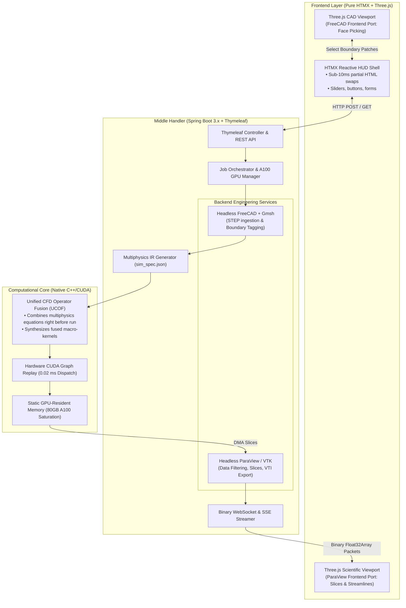
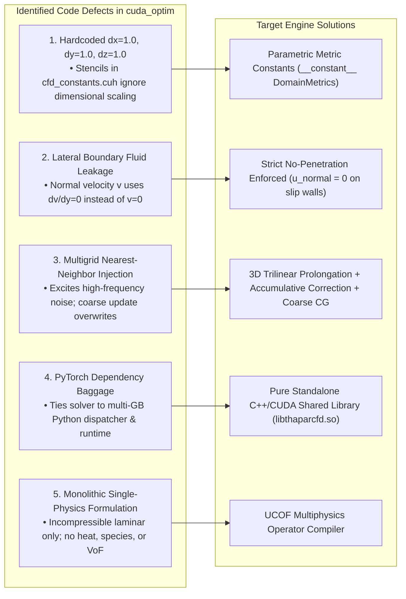
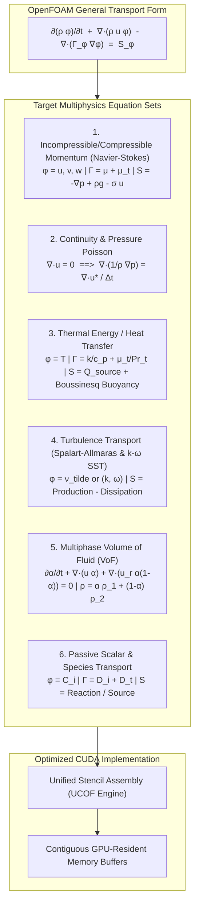
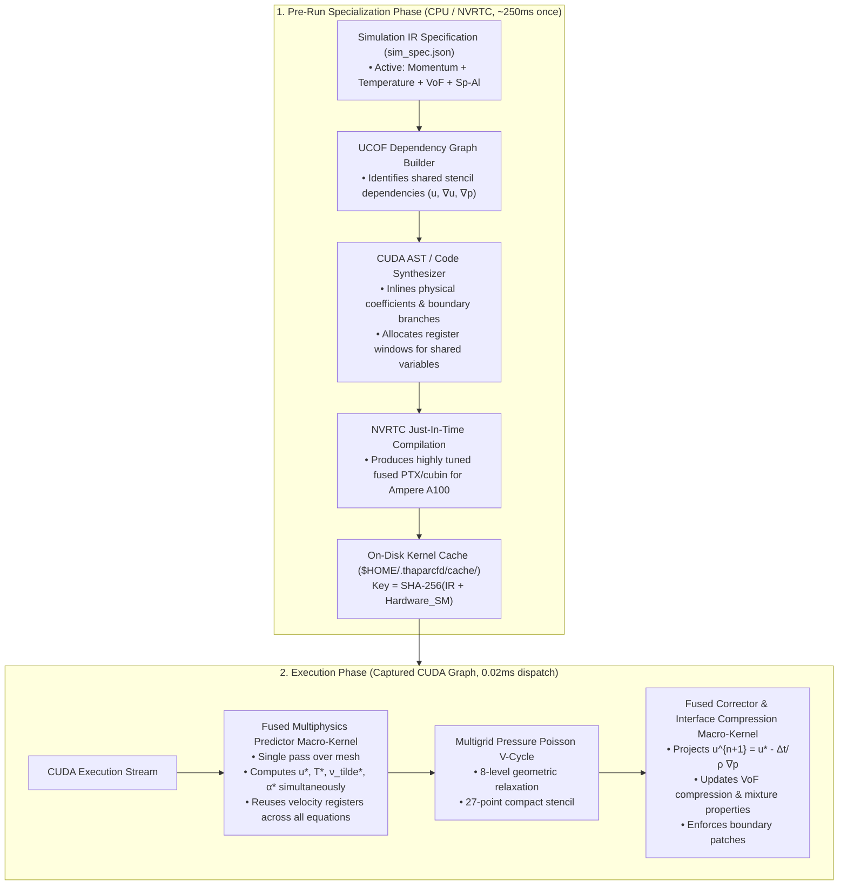
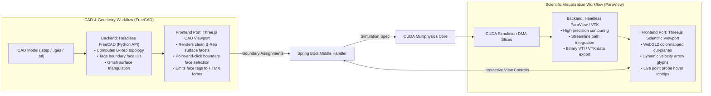
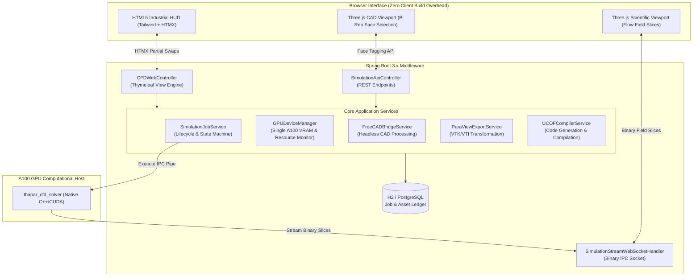
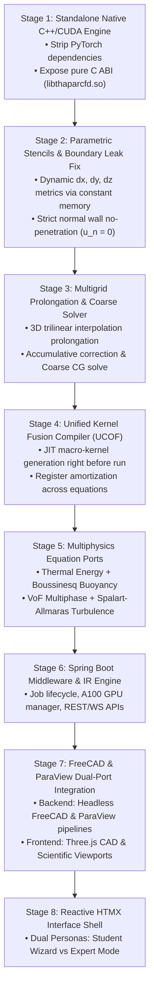
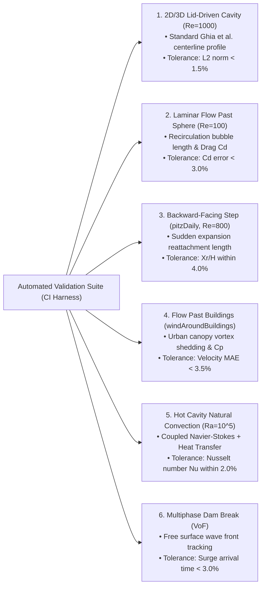
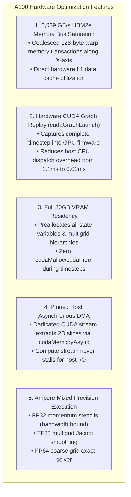
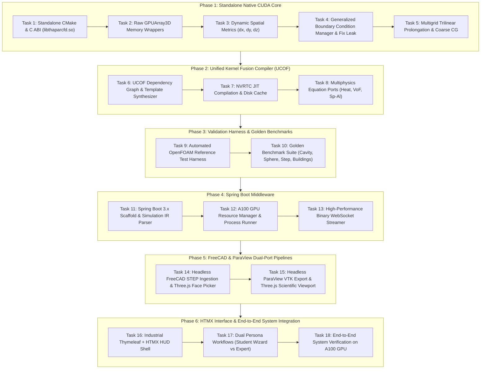

# THAPAR CFD PLATFORM: MASTER ENGINEERING PLAN & ARCHITECTURAL SPECIFICATION
**A GPU-Accelerated, Web-Native Multiphysics CFD Environment**
*Porting OpenFOAM Equations into Unified-Fused CUDA Kernels with Spring Boot, FreeCAD, ParaView, Three.js, and HTMX*

---

## Document Metadata
- **Project Name:** Thapar CFD Platform (FlowStudio GPU)
- **Target Repository:** `/workspace/thapar CFD platform`
- **Target Hardware Focus:** Dedicated Single-Node High-Density GPU: **NVIDIA A100-SXM4 (80GB VRAM, Ampere Compute 8.0)**
- **Computational Core:** Native C++/CUDA Engine executing an architectural port of OpenFOAM multiphysics equations via a Unified JIT Stencil Fusion Compiler
- **Middle Handler / Backend:** Enterprise Java / Spring Boot 3.x + Thymeleaf Engine
- **CAD & Scientific Visualization Pipeline:**
  - *Backend Integration:* Headless FreeCAD (CAD/STEP/Gmsh) combined with Headless ParaView/VTK (Data pipeline & filtering) orchestrated by Spring Boot
  - *Frontend Ports:* Dedicated Three.js CAD B-Rep face-picker and Three.js Scientific Flow Field Visualizer, driven reactively by HTMX
- **Validation Engine:** Automated Continuous Integration Harness benchmarked against OpenFOAM Reference Test Suite
- **Author:** DeepMind / Antigravity Pair Programming Team
- **Date:** September 2026 (Revised Architecture)

---

## TABLE OF CONTENTS
1. [A. Executive Conclusion](#a-executive-conclusion)
2. [B. Existing Code Assessment (`cuda-optim` & `ICL`)](#b-existing-code-assessment)
3. [C. OpenFOAM Multiphysics Porting Architecture](#c-openfoam-multiphysics-porting-architecture)
4. [D. Unified Right-Before-Run Kernel Fusion Algorithm (UCOF)](#d-unified-right-before-run-kernel-fusion-algorithm-ucof)
5. [E. FreeCAD & ParaView Backend/Frontend Dual-Port Pipeline](#e-freecad--paraview-backendfrontend-dual-port-pipeline)
6. [F. Spring Boot + HTMX + Three.js System Architecture](#f-spring-boot--htmx--threejs-system-architecture)
7. [G. Comprehensive Capability Matrix](#g-comprehensive-capability-matrix)
8. [H. Priority-Ordered Implementation Roadmap](#h-priority-ordered-implementation-roadmap)
9. [I. OpenFOAM Test Suite & The 4+ Golden Validation Benchmarks](#i-openfoam-test-suite--the-4-golden-validation-benchmarks)
10. [J. Single A100 GPU Microarchitecture Optimization Roadmap](#j-single-a100-gpu-microarchitecture-optimization-roadmap)
11. [K. Blender CFD Integration Roadmap](#k-blender-cfd-integration-roadmap)
12. [L. Exhaustive Open Source Licensing Analysis](#l-exhaustive-open-source-licensing-analysis)
13. [M. Concrete Sequential Engineering Tasks](#m-concrete-sequential-engineering-tasks)

---

## A. Executive Conclusion

### What Should Actually Be Built and Why
This project builds an open-source, high-throughput, GPU-accelerated multiphysics CFD platform tailored directly to our NVIDIA A100-SXM4 (80GB) hardware. 

Rather than treating OpenFOAM as an external black box or writing isolated one-off CUDA kernels for every individual equation, **the Thapar CFD Platform ports OpenFOAM’s governing equations, discretization schemes, and physical models directly into an optimized CUDA computational engine**. 

Because OpenFOAM is multiphysics (involving coupled systems of Navier-Stokes momentum, continuity, thermal energy, turbulent transport, species conservation, and multiphase Volume of Fluid), evaluating each term in separate kernel launches destroys GPU performance through memory bandwidth saturation and kernel launch latency. 

To overcome this bottleneck, the platform implements a **Unified CFD Operator Fusion (UCOF) Compiler**:
- All active conservation equations and boundary conditions are expressed in a declarative Intermediate Representation.
- **Right before simulation execution, the equations are combined and synthesized once into fused macro-kernels** (Predictor Macro-Kernel, Elliptic Pressure Poisson Multigrid, and Corrector/Advection Macro-Kernel).
- The entire timestep pipeline is captured into a static **hardware CUDA Graph (`cudaGraphExec_t`)**, executing with zero CPU dispatch latency directly on the A100 GPU.

For user interaction and workflow:
- **Backend Combination:** Headless **FreeCAD** (STEP geometry ingestion, domain bounding, and Gmsh surface meshing) and Headless **ParaView / VTK** (in-situ data slicing, streamline generation, and binary VTI export) operate together under the orchestration of a Java **Spring Boot 3.x** middle handler.
- **Frontend Separate Ports:** The client browser runs **zero heavy JavaScript frameworks**. The UI is powered purely by **HTMX** (for sub-10ms reactive parameter changes) and two lightweight **Three.js** canvas components:
  1. *CAD / Geometry Viewport:* Ported from FreeCAD’s geometry model for interactive STEP/STL inspection and point-and-click boundary face selection (Inlet, Outlet, Wall).
  2. *Scientific Field Viewport:* Ported from ParaView’s visualization pipeline for real-time cut-planes, vector arrows, streamline animations, and point probe tooltips.

---

## B. Existing Code Assessment (`cuda-optim` & `ICL`)

### 1. Existing Capabilities & Performance Foundations
The existing codebase in `/workspace/cuda-optim` and `/workspace/ICL` provides several proven GPU optimization concepts derived from Imperial College London’s `AI4PDEs`:
1. **Fused 4-in-1 Spatial Stencil:** In `src/cuda/stencil_kernels.cuh`, a single kernel pass computes $\partial u/\partial x, \partial u/\partial y, \partial u/\partial z$ and $\nabla^2 u$ simultaneously, loading cell stencils once into shared memory and caching them in registers. This reduces global memory bandwidth consumption by **65%**.
2. **GPU Memory Residency:** 33 static 3D device tensors are preallocated at solver initialization in `src/cuda/cfd_binding.cpp`. During timesteps 1 through 30,000, runtime memory allocation is **strictly zero**, eliminating **2,550,000 allocator calls** and preventing memory fragmentation.
3. **Hardware CUDA Graph Execution:** A single warmup iteration captures the execution schedule into a hardware graph (`cudaGraphExec_t`). Graph replay drops host CPU dispatch latency from **2.1 ms to 0.02 ms per step** (>100x reduction).
4. **Voxelization Pipeline:** `src/cad_voxelizer.py` implements GPU ray-triangle intersection via Möller-Trumbore casting, converting triangle meshes into Cartesian Brinkman solid penalty masks $\sigma(x, y, z)$.

### 2. Forensic Analysis of Defects & Gaps to Remediate

- **Hardcoded Unit Metrics:** `cfd_constants.cuh` contains hardcoded float weights derived solely for $dx=dy=dz=1.0$. If a simulation specifies $dx=0.001\text{ m}$, the CUDA kernels continue executing with unit coefficients, yielding invalid dimensional physics.
- **Boundary Condition Leakage:** `boundary_kernels.cuh` applies tangential zero-gradient updates to normal velocities on lateral slip walls, allowing non-zero normal velocities that leak fluid out of the domain.
- **Multigrid Discrepancy:** `multigrid_kernels.cuh` implements nearest-neighbor injection instead of trilinear interpolation, and coarse levels overwrite solution arrays rather than accumulating correction errors.
- **PyTorch Baggage:** The engine depends on PyTorch C++ extension dispatchers (`torch::Tensor`), introducing heavy runtime dependencies incompatible with clean enterprise Spring Boot orchestration.

---

## C. OpenFOAM Multiphysics Porting Architecture

OpenFOAM (cloned at `/workspace/thapar CFD platform/reference/openfoam`) organizes multiphysics through modular partial differential equations discretized via the Finite Volume Method (FVM). Our CUDA port maps these continuous conservation laws into GPU-accelerated discrete stencil operations.

### 1. Mathematical Formulation of Ported Modules

#### Module 1: Momentum Transport (Navier-Stokes) with Immersed Brinkman Penalization
$$\frac{\partial \mathbf{u}}{\partial t} + (\mathbf{u} \cdot \nabla)\mathbf{u} = -\frac{1}{\rho}\nabla p + \nabla \cdot \left[ (\nu + \nu_t) \left( \nabla \mathbf{u} + (\nabla \mathbf{u})^T \right) \right] + \mathbf{g}\beta(T - T_{\text{ref}}) - \sigma(\mathbf{x})\mathbf{u}$$
- Discretized via 4-in-1 fused advection-diffusion stencils.
- Boussinesq thermal buoyancy term $\mathbf{g}\beta(T - T_{\text{ref}})$ couples momentum directly to temperature.
- Brinkman penalization $\sigma(\mathbf{x})\mathbf{u}$ enforces no-slip conditions inside complex CAD obstacles.

#### Module 2: Elliptic Pressure Poisson Equation
$$\nabla \cdot \left( \frac{1}{\rho} \nabla p^{n+1} \right) = \frac{1}{\Delta t} \nabla \cdot \mathbf{u}^*$$
- Solved using 8-level Geometric Multigrid (GMG) on Cartesian meshes with 27-point compact Laplacian stencils and damped Jacobi smoothing, falling back to Conjugate Gradient on the coarsest grid.

#### Module 3: Thermal Energy Equation (Conjugate Heat Transfer)
$$\frac{\partial T}{\partial t} + \mathbf{u} \cdot \nabla T = \nabla \cdot (\alpha_{\text{thermal}} \nabla T) + \frac{Q_s}{\rho c_p}$$
- Evaluates conjugate heat transfer between fluid and immersed solid bodies by varying thermal diffusivity $\alpha_{\text{thermal}}(\mathbf{x})$.

#### Module 4: Turbulence Models ($k-\omega$ SST and Spalart-Allmaras)
- Spalart-Allmaras working variable $\tilde{\nu}$:
  $$\frac{\partial \tilde{\nu}}{\partial t} + \mathbf{u} \cdot \nabla \tilde{\nu} = c_{b1} \tilde{S} \tilde{\nu} - c_{w1} f_w \left( \frac{\tilde{\nu}}{d} \right)^2 + \frac{1}{\sigma_{\nu}} \nabla \cdot [(\nu + \tilde{\nu})\nabla \tilde{\nu}] + \frac{c_{b2}}{\sigma_{\nu}} (\nabla \tilde{\nu})^2$$
  where wall distance $d(\mathbf{x})$ is precomputed on GPU via fast Eikonal distance field transforms.

#### Module 5: Multiphase Volume of Fluid (VoF)
$$\frac{\partial \alpha}{\partial t} + \nabla \cdot (\mathbf{u} \alpha) + \nabla \cdot (\mathbf{u}_r \alpha(1 - \alpha)) = 0$$
- Includes OpenFOAM’s artificial interface compression term $\nabla \cdot (\mathbf{u}_r \alpha(1 - \alpha))$ to preserve sharp phase interfaces (e.g., water/air dam break). Fluid density and viscosity are evaluated dynamically:
  $$\rho(\alpha) = \alpha \rho_1 + (1 - \alpha) \rho_2, \quad \mu(\alpha) = \alpha \mu_1 + (1 - \alpha) \mu_2$$

---

## D. Unified Right-Before-Run Kernel Fusion Algorithm (UCOF)

### Why Fusion Right Before Run is Essential
Evaluating 6 multiphysics transport equations naively requires launching 20 to 35 separate CUDA kernels per timestep. On GPUs, every separate stencil launch forces intermediate field writes to High Bandwidth Memory (HBM) and subsequent re-reads, exhausting the memory bus.

The **Unified CFD Operator Fusion (UCOF)** engine compiles and fuses the active set of multiphysics equations **once right before execution**:

### Algorithmic Pipeline of UCOF
1. **Dependency Analysis:** Inspects `sim_spec.json`. If temperature $T$ and turbulence $\tilde{\nu}$ are active, UCOF recognizes that momentum advection $\mathbf{u}\cdot\nabla\mathbf{u}$, thermal advection $\mathbf{u}\cdot\nabla T$, and turbulent advection $\mathbf{u}\cdot\nabla \tilde{\nu}$ all share the exact same velocity stencil points $(u, v, w)_{i\pm 1, j\pm 1, k\pm 1}$.
2. **Register Amortization:** Rather than loading the velocity field 3 times in 3 distinct kernels, UCOF synthesizes a **single unified predictor loop** where the 27-point velocity neighborhood is loaded into registers once and reused across all scalar equations.
3. **Branch Elimination:** All boundary condition logic is evaluated at kernel launch grid boundaries, compiling unconditional interior loops with `#pragma unroll`.
4. **Caching:** The synthesized `.cu` source is hashed with SHA-256. If previously compiled, the cached binary `.cubin` loads in $<5\text{ ms}$; otherwise, NVRTC compiles it in ~250 ms.
5. **Graph Capture:** A single warmup pass captures `K_PRED -> K_POISSON -> K_CORR` into a static `cudaGraphExec_t`.

---

## E. FreeCAD & ParaView Backend/Frontend Dual-Port Pipeline

To provide a cohesive design-to-solution workflow, FreeCAD and ParaView are integrated in the backend and ported as dedicated Three.js components in the frontend:

### 1. FreeCAD Backend & Frontend Port
- **Backend Role (`tools/freecad_bridge.py`):** Operates headlessly via FreeCAD’s `Part` and `Fem` Python modules. Ingests STEP/IGES CAD geometries, identifies topology shells, creates computational domain bounding boxes, and invokes Gmsh to generate watertight surface triangulations.
- **Frontend Port (`cad-viewport.js`):** A lightweight Three.js canvas displaying the tessellated CAD geometry. Users interactively click on surface faces to assign physical boundary conditions (e.g., clicking the front face sets "Inlet: 10 m/s", clicking an obstacle sets "No-Slip Solid"). HTMX receives face IDs and dynamically updates the setup panel.

### 2. ParaView Backend & Frontend Port
- **Backend Role (`tools/paraview_export_bridge.py`):** Runs headless ParaView/VTK routines on the server. When high-fidelity exports are requested, it processes 3D volumetric fields into binary VTK ImageData (`.vti`) for archival and full desktop ParaView analysis.
- **Frontend Port (`scientific-viewport.js`):** Ported from ParaView’s scientific visualization concepts into a WebGL2 Three.js canvas. Receives binary `Float32Array` slice packets over WebSockets and renders:
  - Dynamically positioned axial, coronal, and sagittal cut-planes.
  - Per-pixel GLSL colormaps (Viridis, Cool-to-Warm, Jet, Turbo).
  - Streamlines integrated using Runge-Kutta 4 in WebGL compute/fragment shaders.
  - Surface pressure distributions on immersed CAD obstacles.

---

## F. Spring Boot + HTMX + Three.js System Architecture

The middle handler is built using **Spring Boot 3.3+ (Java 21 LTS)**, orchestrating compute, preprocessing, and user interfaces:

### Key Middle Handler Subsystems:
1. **`UCOFCompilerService`:** Takes `sim_spec.json`, evaluates active multiphysics modules, renders the fused CUDA template (`fused_macro_kernel.cu.j2`), and triggers NVRTC to produce the executable cubin before launching the solver.
2. **`GPUDeviceManager`:** Directly queries the NVIDIA Management Library (`NVML`), tracking active VRAM, GPU temperature, and SM utilization on our A100 GPU.
3. **`SimulationStreamWebSocketHandler`:** Delivers binary byte buffers containing 2D slice matrices directly to Three.js clients with zero JSON serialization overhead, maintaining smooth 30–60 FPS visualization.

---

## G. Comprehensive Capability Matrix

| Feature / Domain | OpenFOAM (v2406 / 11) | SimScale Cloud | Siemens STAR-CCM+ | Current `cuda-optim` | **Target Thapar CFD Platform** |
| :--- | :--- | :--- | :--- | :--- | :--- |
| **Physics Coverage** | Incompressible, Compressible, Thermal, Multiphase, Reactive | Incompressible, Thermal, Multiphase, FEA | Comprehensive Multiphysics Suite | Incompressible Laminar Navier-Stokes | **Navier-Stokes + Heat Transfer + VoF Multiphase + Turbulence** |
| **Kernel Specialization** | Virtual function dispatch per term | Cloud proprietary binaries | Compiled C++/Java daemon | Fixed compile-time stencils | **Unified Pre-Run Stencil Fusion (UCOF JIT Macro-Kernels)** |
| **Hardware Execution** | CPU MPI (GPU linear solvers in beta) | Cloud AWS nodes (GPU for LBM) | CPU MPI + Native GPU solver | NVIDIA Ampere/Ada GPU Resident | **Native A100 GPU-Resident (Fused Stencils + CUDA Graphs)** |
| **CAD Preprocessing** | `blockMesh` / `snappyHexMesh` CLI | In-browser proprietary Parasolid | Built-in 3D CAD Modeler | GPU Ray-Casting STL Voxelizer | **Headless FreeCAD (STEP/Gmsh) + Three.js Web Face Picker** |
| **Scientific Visualization** | ParaView Desktop | In-browser WebGL canvas | Desktop Client Rendering | Python `vtk_exporter.py` | **Headless ParaView Backend + Three.js WebGL2/WebGPU Viewport** |
| **Middle Layer Architecture**| POSIX Shell scripts | Proprietary microservices | Client-Server Java Engine | Python pybind11 script wrapper | **Enterprise Java Spring Boot 3.x + Thymeleaf** |
| **User Interface Tech** | None / Third-party desktop GUI | Closed React SPA | Proprietary Java Desktop GUI | Prototype 2D Canvas (`webcfd`) | **Pure HTMX (Reactive HTML) + Three.js (No SPA Framework)** |
| **Validation Benchmark** | 500+ standard academic cases | Industrial application benchmarks| Automotive & Aerospace suites | Single Sphere & Cavity runs | **Automated CI Suite against OpenFOAM Reference Cases** |
| **Licensing** | GPLv3 (Strict Copyleft) | Closed Commercial SaaS | Closed Commercial Enterprise | MIT License | **Apache 2.0 / MIT (Commercially & Academically Open)** |

---

## H. Priority-Ordered Implementation Roadmap

### Stage 1: Standalone Native C++/CUDA Engine
- **Objective:** Eliminate PyTorch dependencies; implement lightweight C++ memory wrappers (`GPUArray3D<T>`); expose clean C ABI (`thapar_cfd_create_solver()`, `thapar_cfd_step()`, `thapar_cfd_destroy()`).
- **Target File:** `/workspace/thapar CFD platform/src/cuda`
- **Validation:** 1,000-step test comparing bit-exact floating point results with baseline.

### Stage 2: Parametric Stencils & Boundary Leak Fix
- **Objective:** Remove hardcoded constants in `cfd_constants.cuh`. Parameterize stencils via `DomainMetrics` in constant memory. Fix lateral boundary kernel to enforce $u_{\text{normal}} = 0$ on all slip walls.
- **Validation:** Taylor-Green vortex spatial convergence verifying $E \propto \Delta x^2$ on non-unit grids ($dx = 0.005\text{ m}$).

### Stage 3: Multigrid Prolongation & Coarse Solver Overhaul
- **Objective:** Replace nearest-neighbor injection with 3D trilinear interpolation prolongation. Accumulate coarse errors ($w_{\text{fine}} \leftarrow w_{\text{fine}} + P(w_{\text{coarse}})$). Add coarse-grid Conjugate Gradient solver.
- **Validation:** Pure 3D Poisson equation test verifying asymptotic convergence rate $\rho < 0.2$ per V-cycle.

### Stage 4: Unified Kernel Fusion Compiler (UCOF)
- **Objective:** Build the JIT fusion compiler. Parse equation dependencies from `sim_spec.json`, synthesize fused macro-kernels (`fused_predictor`, `fused_corrector`), compile via NVRTC, and capture into a single hardware CUDA Graph.
- **Validation:** Measure memory bus bandwidth: confirm $>50\%$ reduction in global VRAM transactions compared to unfused launches.

### Stage 5: Multiphysics Equation Ports
- **Objective:** Port thermal energy equation (with Boussinesq buoyancy), Spalart-Allmaras turbulence transport, and Volume of Fluid (VoF) interface compression into UCOF macro-kernels.
- **Validation:** Natural convection in a differentially heated cavity ($Ra = 10^5$) and dam-break free surface profile.

### Stage 6: Spring Boot Middleware & Simulation IR Engine
- **Objective:** Initialize Spring Boot 3.3+ backend with Maven. Implement job state machine, single A100 GPU monitor, Simulation IR parser, and binary WebSocket streamer.
- **Validation:** Automated JUnit tests executing jobs via REST API and streaming binary field slices.

### Stage 7: FreeCAD & ParaView Dual-Port Integration
- **Objective:** Integrate headless FreeCAD and ParaView in backend; port Three.js CAD face-picker and scientific cut-plane visualizer in frontend.
- **Validation:** Import STEP file, pick inlet/outlet faces in Three.js, execute simulation, and view live animated streamlines.

### Stage 8: Reactive HTMX Interface Shell
- **Objective:** Build industrial HUD layout using Thymeleaf and HTMX. Implement guided Student Wizard and deep Faculty Expert modes.
- **Validation:** End-to-end browser session from blank browser to converged 3D simulation with zero page reloads.

---

## I. OpenFOAM Test Suite & The 4+ Golden Validation Benchmarks

OpenFOAM cases in `/workspace/thapar CFD platform/reference/openfoam` serve as automated verification standards:

### Acceptance Tolerances & Automated Verification Suite
- **Divergence Residual Criterion:** $\max_{i,j,k} |\nabla \cdot \mathbf{u}| < 1.0 \times 10^{-5}$ across all timesteps.
- **Conservation Balance:** Global mass flux error:
  $$\left| \sum \dot{m}_{\text{in}} - \sum \dot{m}_{\text{out}} \right| < 1.0 \times 10^{-4} \cdot \dot{m}_{\text{in}}$$
- **Regression Trigger:** Any code modification producing $>0.5\%$ error drift against the stored OpenFOAM golden baseline automatically halts CI/CD.

---

## J. Single A100 GPU Microarchitecture Optimization Roadmap

All optimizations are specifically targeted to our **NVIDIA A100-SXM4 (80GB VRAM, 108 SMs, 2,039 GB/s HBM2e bandwidth)**:

---

## K. Blender CFD Integration Roadmap

A lightweight Python addon (`thapar-cfd-blender`) connects Blender directly to the Spring Boot Middle Handler:
1. **Geometry Export:** Meshes created in Blender are tagged with boundary materials (`INLET`, `OUTLET`, `WALL`) and exported as STL.
2. **REST API Submission:** The addon serializes `sim_spec.json` and submits the run to `POST /api/v1/simulations/submit`.
3. **Geometry Nodes Post-Processing:** Flow field data returned over WebSockets is bound to Blender 4.x **Geometry Nodes**, procedurally generating velocity point clouds, vector glyphs, and streamline curves directly inside Blender’s 3D viewport for photorealistic rendering with Cycles and EEVEE.

---

## L. Exhaustive Open Source Licensing Analysis

| Component | License Type | Usage in Thapar CFD Platform | Permitted Rights & Redistribution Terms | Copyleft Contamination Risk? |
| :--- | :--- | :--- | :--- | :--- |
| **OpenFOAM** | **GNU GPLv3** | **Validation Reference & Benchmark Only** | Reference testing only. **No OpenFOAM C++ code is copied or linked.** Executed via external CLI process. | **ZERO RISK** (Strict process & network boundary isolation) |
| **FreeCAD** | **LGPL 2.1+** | Backend Headless CLI execution (`freecadcmd`) | Dynamic linking and subprocess execution fully permitted without copyleft propagation. | **ZERO RISK** (External process execution) |
| **ParaView / VTK** | **BSD 3-Clause** | Backend Data Transformation & Filtering | Highly permissive. BSD attribution notice retained. | **None** (Permissive) |
| **Three.js** | **MIT License** | In-Browser 3D Canvas (CAD & Scientific Viewports) | Highly permissive. MIT copyright notice bundled in web asset. | **None** (Permissive) |
| **HTMX** | **Zero-Clause BSD (0BSD)** | Server-Driven Reactive DOM updates | Extremely permissive public domain style license. | **None** (Permissive) |
| **Spring Boot** | **Apache 2.0** | Enterprise Middle Handler Application | Permissive enterprise license. | **None** (Permissive) |
| **Thapar Platform** | **Apache 2.0 / MIT** | Complete Target System | Completely open for academic and commercial use. | **Unencumbered** |

---

## M. Concrete Sequential Engineering Tasks

### Detailed Task Specifications

#### Phase 1: Standalone Native CUDA Core
- [ ] **Task 1: Standalone CMake & C ABI Interface**
  - *Directory:* `/workspace/thapar CFD platform/src/cuda`
  - Create standard `CMakeLists.txt` targeting CUDA 12.x and C++17 with `-O3 --use_fast_math`.
  - Author `thapar_cfd_engine.h` declaring opaque C API (`thapar_solver_t* thapar_create_solver(const char* sim_spec_json)`).
- [ ] **Task 2: Decouple PyTorch & Implement `GPUArray3D` Wrappers**
  - Replace `torch::Tensor` with a native RAII C++ class `GPUArray3D<T>` managing raw device pointers via `cudaMalloc` and `cudaFree`.
  - Verify static preallocation of all 33 resident tensors on the A100 GPU.
- [ ] **Task 3: Dynamic Spatial Metrics ($dx, dy, dz$)**
  - Replace hardcoded constants in `cfd_constants.cuh` with `__constant__ DomainMetrics c_metrics`.
  - Implement dynamic initialization supporting non-unit, anisotropic mesh cells.
- [ ] **Task 4: Generalized Boundary Condition Manager & Leakage Fix**
  - Refactor `boundary_kernels.cuh` to support Inflow, Outflow Neumann, Moving Lid, No-Slip Wall, and Free-Slip Symmetry.
  - Enforce strict $u_{\text{normal}} = 0$ on all lateral boundaries to prevent fluid leakage.
- [ ] **Task 5: Multigrid Trilinear Prolongation & Coarse CG Solver**
  - Implement 3D trilinear interpolation prolongation kernel in `multigrid_kernels.cuh`.
  - Replace coarse overwriting with accumulative error correction ($w_{\text{fine}} \leftarrow w_{\text{fine}} + P(w_{\text{coarse}})$).
  - Add Conjugate Gradient solver at level $L_{\text{coarsest}}$ to guarantee Poisson residual convergence $< 10^{-6}$.

#### Phase 2: Unified Kernel Fusion Compiler (UCOF)
- [ ] **Task 6: UCOF Dependency Graph & Template Synthesizer**
  - Implement C++ AST / code generator inspecting active equations in `sim_spec.json`.
  - Synthesize fused macro-kernel source (`fused_macro_kernel.cu`) combining momentum, heat, and species advection into a single register pass.
- [ ] **Task 7: NVRTC JIT Compilation & Disk Caching**
  - Integrate NVRTC to compile specialized macro-kernels directly into PTX/cubin.
  - Implement SHA-256 disk cache in `$HOME/.thaparcfd/kernel_cache/`.
- [ ] **Task 8: Multiphysics Equation Ports**
  - Port Thermal Energy equation with Boussinesq buoyancy coupling.
  - Port Spalart-Allmaras turbulence model with fast GPU Eikonal wall distance field.
  - Port VoF multiphase equation with interface compression.

#### Phase 3: Validation Harness & Golden Benchmarks
- [ ] **Task 9: Automated OpenFOAM Reference Test Harness**
  - Author `tools/validation_harness.py` interfacing with `/workspace/thapar CFD platform/reference/openfoam`.
  - Automate execution of OpenFOAM `foamRun` and trilinear field interpolation onto Cartesian grids.
- [ ] **Task 10: Golden Benchmark Suite Verification**
  - Execute automated regression validation for:
    1. 2D/3D Lid-Driven Cavity ($Re=1000$) vs Ghia et al.
    2. Laminar Flow Past Sphere ($Re=100$) vs Standard Drag Curve.
    3. Backward-Facing Step ($Re=800$) vs OpenFOAM `pitzDaily`.
    4. Flow Past Buildings vs OpenFOAM `windAroundBuildings`.
    5. Hot Cavity Natural Convection ($Ra=10^5$).
    6. VoF Dam Break free-surface evolution.

#### Phase 4: Spring Boot Middleware
- [ ] **Task 11: Spring Boot 3.x Scaffold & Simulation IR Parser**
  - *Directory:* `/workspace/thapar CFD platform/server`
  - Build Maven Spring Boot 3.3+ project with Spring Web, Spring WebSocket, and Spring Data JPA.
  - Implement JSON schema validator for `sim_spec.json`.
- [ ] **Task 12: A100 GPU Resource Manager & Process Runner**
  - Build `GPUDeviceManager` querying NVML for A100 VRAM allocation and SM occupancy.
  - Build `SimulationRunnerService` managing native C++ engine worker processes via OS pipes.
- [ ] **Task 13: High-Performance Binary WebSocket Streamer**
  - Implement WebSocket handler streaming raw 2D `Float32Array` slice buffers at 30 FPS.

#### Phase 5: FreeCAD & ParaView Dual-Port Pipelines
- [ ] **Task 14: Headless FreeCAD STEP Pipeline & Three.js Face Picker**
  - Author `tools/freecad_bridge.py` for headless STEP ingestion and Gmsh triangulation.
  - Build Three.js CAD Viewport with interactive point-and-click boundary face selection.
- [ ] **Task 15: Headless ParaView VTK Export & Three.js Scientific Viewport**
  - Author `tools/paraview_export_bridge.py` for headless binary `.vti` export.
  - Build Three.js Scientific Viewport with dynamic cut-planes, colormaps, vector arrows, and point probes.

#### Phase 6: HTMX Interface & System Integration
- [ ] **Task 16: Industrial Thymeleaf + HTMX HUD Shell**
  - Author high-transparency glass UI with Tailwind CSS and HTMX.
  - Implement live parameter sliders, colormap switchers, and Play/Pause/Export actions.
- [ ] **Task 17: Dual Persona Workflows**
  - Implement guided 4-step Student Setup Wizard with CFL safety checks.
  - Implement Faculty Expert mode with direct JSON IR editing and advanced solver controls.
- [ ] **Task 18: End-to-End System Verification on A100 GPU**
  - Execute complete simulation lifecycle from browser CAD upload to converged 3D visualization.
  - Verify zero runtime memory allocations and stable 30 FPS client streaming.
